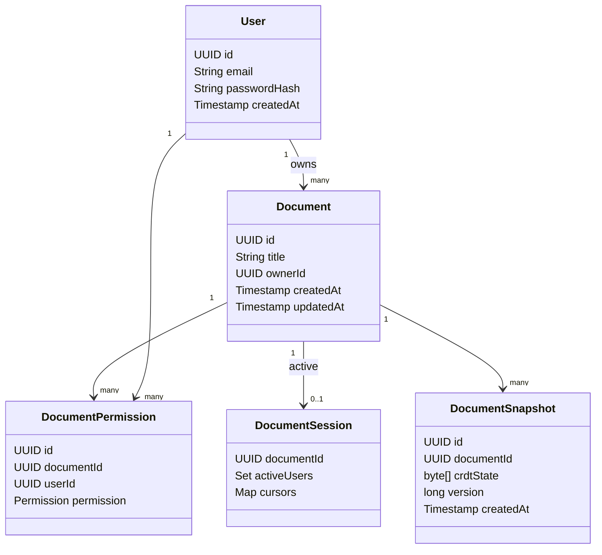
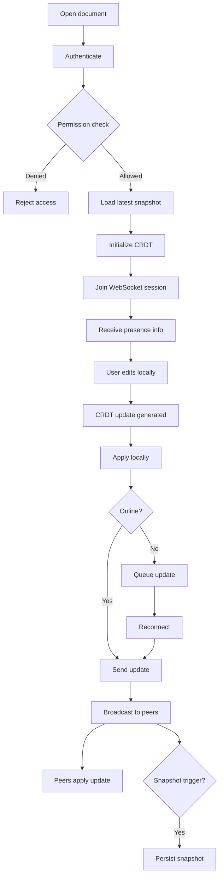
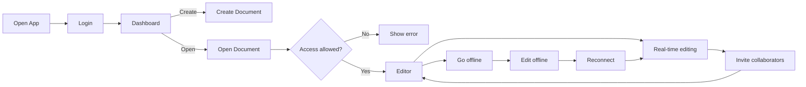

# CRDT-Based Collaborative Document Editor

## 1. Overview
This document describes the **end-to-end system design** of a **CRDT-based, offline-first, real-time collaborative document editing application**.

The system is inspired by tools like Google Docs but intentionally solves problems Google Docs cannot solve well:
- True offline-first collaboration
- Local-first updates with zero typing latency
- Eventual consistency without a central coordinator
- Future support for peer-to-peer and end-to-end encryption

The backend is implemented as a **modular monolith using Spring Boot**, hosted on free-tier infrastructure.

---

## 2. Design Goals

- **Offline-first**: Users can edit documents without network connectivity
- **Low latency**: No server round-trips required for local edits
- **Correct concurrency**: No conflicts or locks
- **Scalable later**: Easy evolution to Redis / microservices
- **Simple backend**: Backend never interprets document content

---

## 3. Core Architectural Principles

1. **CRDT as source of truth** – document state lives with clients
2. **Backend as relay + persistence** – not a transformation engine
3. **Local-first UX** – edits apply instantly
4. **Ephemeral collaboration state** – presence & cursors are not persisted
5. **Snapshots, not edit logs** – efficient recovery

---

## 4. High-Level Architecture

```text
Client (Web / Mobile / Desktop)
  ├─ Yjs CRDT
  ├─ Local persistence
  ├─ Offline update queue
  │
  ├─ REST (Auth, Docs)
  └─ WebSocket (CRDT sync)
          │
Spring Boot Backend (Modular Monolith)
  ├─ Auth
  ├─ Document metadata
  ├─ Collaboration relay
  ├─ Presence tracking
  └─ Snapshot scheduler
          │
PostgreSQL
  ├─ Users
  ├─ Documents (metadata)
  └─ CRDT snapshots
```

---

## 5. Backend Logical Layers

### 5.1 Interface Layer
- REST Controllers
- WebSocket Handlers

Purpose: Protocol handling and authentication

---

### 5.2 Domain Layer
- Auth
- Document metadata
- Collaboration coordination

Purpose: Business meaning

---

### 5.3 Infrastructure Layer
- Database access
- Snapshot persistence
- Security
- Scheduling

Purpose: Technical execution

---

## 6. State Ownership Model

| State | Owner |
|-----|------|
| Document content | CRDT (clients) |
| Authentication | Backend |
| Permissions | Backend |
| Presence & cursors | Backend (ephemeral) |
| History | Snapshots |
| Conflict resolution | CRDT algorithm |

---

## 7. Object-Oriented Diagrams

### 7.1 Class Diagram (Domain-Level)



---

### 7.2 ER Diagram (Persistence Only)

```mermaid
erDiagram
    USERS {
        UUID id PK
        VARCHAR email UNIQUE
        TEXT password_hash
        TIMESTAMP created_at
    }

    DOCUMENTS {
        UUID id PK
        VARCHAR title
        UUID owner_id FK
        TIMESTAMP created_at
        TIMESTAMP updated_at
    }

    DOCUMENT_PERMISSIONS {
        UUID id PK
        UUID document_id FK
        UUID user_id FK
        VARCHAR permission
    }

    DOCUMENT_SNAPSHOTS {
        UUID id PK
        UUID document_id FK
        BYTEA crdt_state
        BIGINT version
        TIMESTAMP created_at
    }

    USERS ||--o{ DOCUMENTS : owns
    USERS ||--o{ DOCUMENT_PERMISSIONS : granted
    DOCUMENTS ||--o{ DOCUMENT_PERMISSIONS : shared_with
    DOCUMENTS ||--o{ DOCUMENT_SNAPSHOTS : persisted_as
```

**Explicitly NOT persisted:**
- CRDT updates
- Presence
- Cursors
- Document sessions

---

### 7.3 Activity Diagram (Collaboration Lifecycle)



---

### 7.4 User Flow Diagram



---

## 8. Runtime Data Flows

### 8.1 Live Editing
- Local CRDT update
- WebSocket relay
- Peer convergence

### 8.2 Offline Editing
- Updates queued locally
- Sync on reconnect
- Automatic merge

### 8.3 Persistence
- Periodic CRDT snapshots
- Compressed storage
- Fast recovery

---

## 9. Security Model

- JWT authentication
- JWT validated during REST and WebSocket handshake
- Permission checks before joining document session
- Backend does not inspect document content

Future:
- End-to-end encrypted CRDT updates

---

## 10. Deployment Architecture

- Backend: Spring Boot + Docker
- Hosting: Render (free tier)
- Database: Neon / Supabase PostgreSQL
- Optional: Redis (later scaling)

---

## 11. Scaling Strategy

1. Horizontal scaling with sticky WebSockets
2. Redis Pub/Sub for multi-node fan-out
3. Service extraction (Collaboration, Snapshots)

---

## 12. Interview-Grade Summary

> This system is a local-first, CRDT-driven collaborative editor. Clients own document state, while the backend acts as a stateless relay and snapshot persistence layer, enabling low-latency real-time collaboration, offline support, and eventual consistency.

---

## 13. Future Enhancements

- Peer-to-peer sync (WebRTC)
- End-to-end encryption
- Versioning & branching
- Collaborative code editing (AST CRDT)

---

**End of Document**

